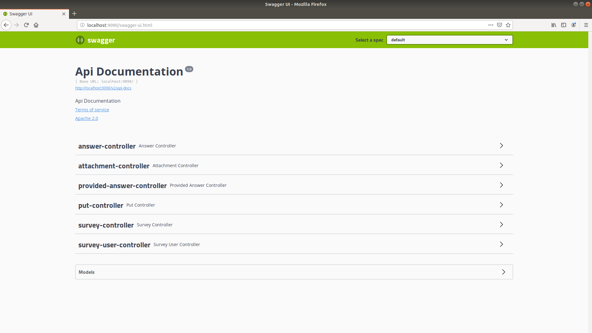

# SurveyShrike - an online survey application

SurveyShrike is a java-11, spring-boot project with redis caching and uses amazon s3 for document storage.

### Requirements

  - jdk - 11
  - maven
  - redis
  - postgres
  - docker
  - git

### Installation

Follow the instructions for debian based linux distros

- JDK
 ```sh
$ sudo apt update
$ sudo apt install openjdk-11-jre openjdk-11-jdk
```

- Maven
If using Intellij use the maven bundled
Other wise 
    * Download maven from https://maven.apache.org/download.cgi
    * Extract the tar
    * Add bin to the Path variable => PATH=$PATH:${MAVEN_HOME}/bin

- Redis
         ```sh
        $ sudo apt install redis-server
        ```

- Postgres
    ```sh
    $ sudo apt-get install wget ca-certificates
    $ wget --quiet -O - https://www.postgresql.org/media/keys/ACCC4CF8.asc | sudo apt-key add -
    $ sudo sh -c 'echo "deb http://apt.postgresql.org/pub/repos/apt/ `lsb_release -cs`-pgdg main" >> /etc/apt/sources.list.d/pgdg.list'
    $ sudo apt-get update
    $ sudo apt-get install postgresql postgresql-contrib
    #To connect
    $ sudo su - postgres
    $ psql
    # To quit
    $ \q 
    ```

- Docker
        ```sh
        $ sudo apt install docker.io
        # To start
        $ sudo systemctl start docker
        # To stop
        $ sudo systemctl stop docker
        ```
- Git
        ```sh
        $ apt install git-core
        ```

### Starting the application
- Clone the project
        ```sh
        $ git clone https://github.com/jeyaram-a/SShrike.git
        ```

- Move to the directory
        ```sh
        $ cd sshrike
        ```

- Compile the code
        ```sh
        $ mvn clean install
        ```

- Start the application
    * Liquibase will do initialization of tables
    *  command to start application
            ```sh
            $ java -jar sshrike*.jar
            ```
- Visit swagger page
     * http://localhost:9090/swagger-ui.html
    * Basic auth
        * Username - user
        * Password - password



### Schema Information
- ER - Diagram


### Flow of Events for UI client
- Creation of survey:
    1. Create a user using **/user** endpoint
    2. Create a survey using **/survey** endpoint
- Taking a survey:
    1. For every question answered use **/answer/save** endpoint to store the offered answer
    2. If question requires to upload file
        * Use **/offeredans/file** endpoint to store the file which stores the file in Amazon s3 and updates db
        * Use that id to store the offered answer using **/answer/save** endpoint


##CI|CD Pipeline
- Run the following command to install jenkins in docker
        ```sh
        docker run \
          -u root \
          --rm \
          -d \
          -p 8080:8080 \
          -p 50000:50000 \
          -v jenkins-data:/var/jenkins_home \
          -v /var/run/docker.sock:/var/run/docker.sock \
          jenkinsci/blueocean
        ```
        
- For more info on setting up jenkins please visit https://jenkins.io/doc/book/installing/.
- This pipeline clones the projects, builds and installs in the local system


